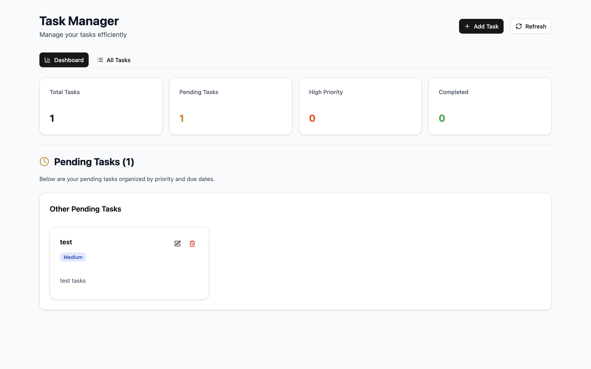
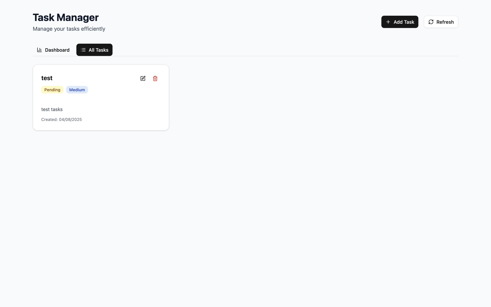
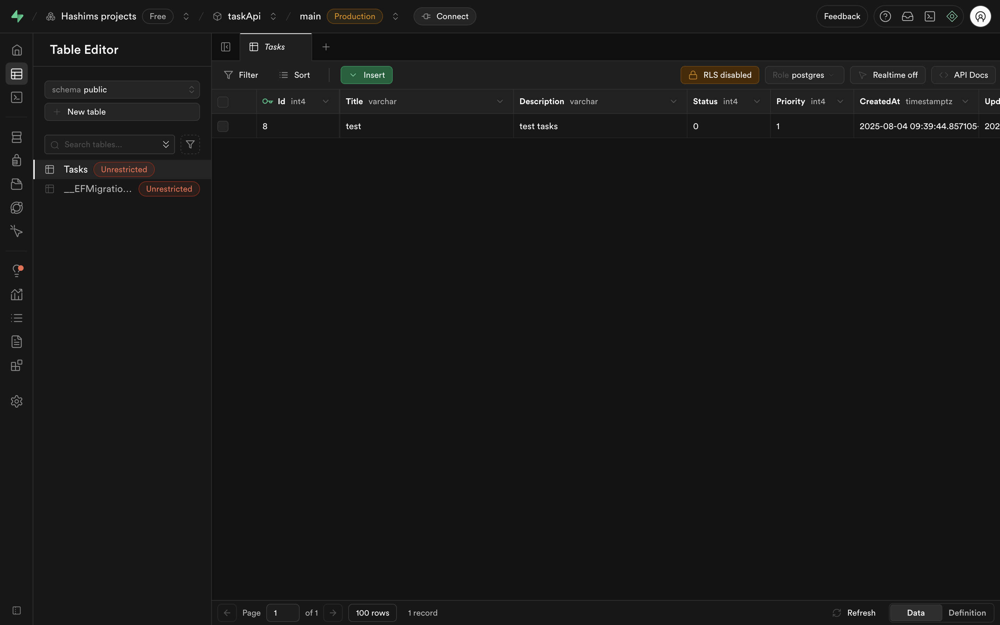

# C# Task Management API

A C# .NET 8 Web API project built to learn backend development with Entity Framework Core and PostgreSQL. This project demonstrates modern C# development practices, database design, and API development.

## 🎨 UI Showcase





## 🎯 Learning Focus

This project was created specifically to learn **C# backend development**:

- **C# Language**: Modern C# syntax, async/await, LINQ, and generics
- **ASP.NET Core**: Web API development, controllers, middleware, and dependency injection
- **Entity Framework Core**: ORM patterns, migrations, and data modeling
- **PostgreSQL**: Relational database concepts and SQL
- **API Design**: RESTful endpoints, HTTP status codes, and validation

## 🏗️ C# Backend Architecture

### Core Technologies

- **C# .NET 8** - Modern, high-performance framework
- **ASP.NET Core Web API** - RESTful API framework
- **Entity Framework Core** - ORM for database operations
- **PostgreSQL** - Robust, open-source database
- **Swagger/OpenAPI** - API documentation

### Project Structure

```
TaskApi/
├── Controllers/         # API endpoints (TasksController.cs)
├── Models/             # Entity models (Task.cs)
├── Data/               # Database context (ApplicationDbContext.cs)
├── Migrations/         # EF Core migrations
├── Program.cs          # Application entry point
└── appsettings.json    # Configuration
```

## 🚀 C# Features Implemented

### Backend API

- ✅ **CRUD Operations**: Complete Create, Read, Update, Delete for tasks
- ✅ **Data Validation**: C# Data Annotations for model validation
- ✅ **HTTP Status Codes**: Proper RESTful response codes
- ✅ **Error Handling**: Comprehensive exception handling and logging
- ✅ **CORS Configuration**: Cross-origin resource sharing setup
- ✅ **Swagger Documentation**: Auto-generated API documentation

### Database Design

- ✅ **Entity Framework Core**: ORM with code-first approach
- ✅ **PostgreSQL Integration**: Production-ready database
- ✅ **Migrations**: Database schema versioning
- ✅ **Indexed Columns**: Performance optimization
- ✅ **Proper Data Types**: C# types mapped to SQL types



**Database:** The project uses Supabase as the PostgreSQL provider, offering a managed database solution with real-time capabilities.

## 📚 C# Learning Outcomes

Through building this project, I gained experience with:

### C# Language Features

- **Async/Await**: Non-blocking database operations
- **LINQ**: Language Integrated Query for data manipulation
- **Generics**: Type-safe collections and methods
- **Reflection**: Runtime type inspection
- **Attributes**: Data annotations for validation

### ASP.NET Core Concepts

- **Dependency Injection**: Service container and lifetime management
- **Middleware Pipeline**: Request/response processing
- **Model Binding**: Automatic request data mapping
- **Action Results**: Typed HTTP responses
- **Route Configuration**: Attribute-based routing

### Entity Framework Core

- **DbContext**: Database session management
- **DbSet**: Database table representation
- **Migrations**: Database schema evolution
- **Code-First**: Database design from C# classes
- **LINQ to Entities**: Database queries in C#

## 🛠️ C# Development Setup

### Prerequisites

- .NET 8 SDK
- PostgreSQL 15+
- IDE (Visual Studio Code, Visual Studio, or Rider)

### Backend Quick Start

```bash
cd TaskApi
dotnet restore
dotnet run
```

The API will be available at `https://localhost:7000` with Swagger documentation at `https://localhost:7000/swagger`.

## 🔗 C# API Endpoints

| Method | Endpoint          | Description       | C# Controller Method    |
| ------ | ----------------- | ----------------- | ----------------------- |
| GET    | `/api/tasks`      | List all tasks    | `GetTasks()`            |
| GET    | `/api/tasks/{id}` | Get specific task | `GetTask(int id)`       |
| POST   | `/api/tasks`      | Create new task   | `CreateTask(Task)`      |
| PUT    | `/api/tasks/{id}` | Update task       | `UpdateTask(int, Task)` |
| DELETE | `/api/tasks/{id}` | Delete task       | `DeleteTask(int)`       |

## 📖 C# Code Examples

### Task Model (C# Class)

```csharp
public class Task
{
    public int Id { get; set; }

    [Required]
    [StringLength(200)]
    public string Title { get; set; } = string.Empty;

    public TaskStatus Status { get; set; } = TaskStatus.Pending;
    public TaskPriority Priority { get; set; } = TaskPriority.Medium;

    public DateTime CreatedAt { get; set; } = DateTime.UtcNow;
    public DateTime? UpdatedAt { get; set; }
}
```

### API Controller (C# Controller)

```csharp
[ApiController]
[Route("api/[controller]")]
public class TasksController : ControllerBase
{
    private readonly ApplicationDbContext _context;

    public TasksController(ApplicationDbContext context)
    {
        _context = context;
    }

    [HttpGet]
    public async Task<ActionResult<IEnumerable<Task>>> GetTasks()
    {
        var tasks = await _context.Tasks
            .OrderByDescending(t => t.CreatedAt)
            .ToListAsync();
        return Ok(tasks);
    }
}
```

## 🎓 C# Learning Journey

This project demonstrates key C# development concepts:

1. **Object-Oriented Programming**: Classes, inheritance, and polymorphism
2. **Modern C# Features**: Nullable reference types, pattern matching
3. **Asynchronous Programming**: Async/await for I/O operations
4. **Dependency Injection**: Service lifetime and configuration
5. **Data Access**: Entity Framework Core patterns
6. **API Development**: RESTful design principles
7. **Error Handling**: Exception management and logging
8. **Testing**: Unit testing with xUnit (future enhancement)

## 📚 Documentation

For detailed C# setup instructions and implementation guide, see [instructions.md](./instructions.md).

## 🎨 Frontend (Brief)

The project includes a React TypeScript frontend for demonstration purposes, but the primary focus is on the C# backend. The frontend showcases:

- Modern React 18 with TypeScript
- Tailwind CSS with shadcn/ui components
- API integration with the C# backend
- Real-time task management interface

## 📝 License

This project is for educational purposes and personal C# learning.
